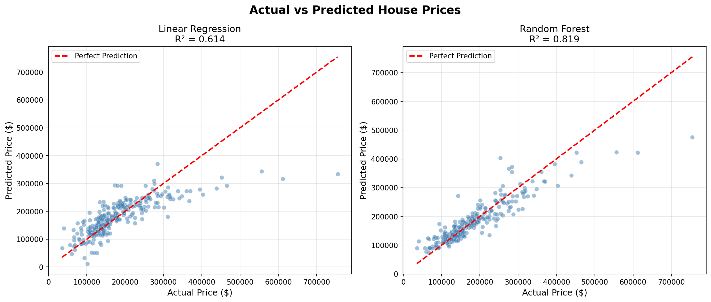
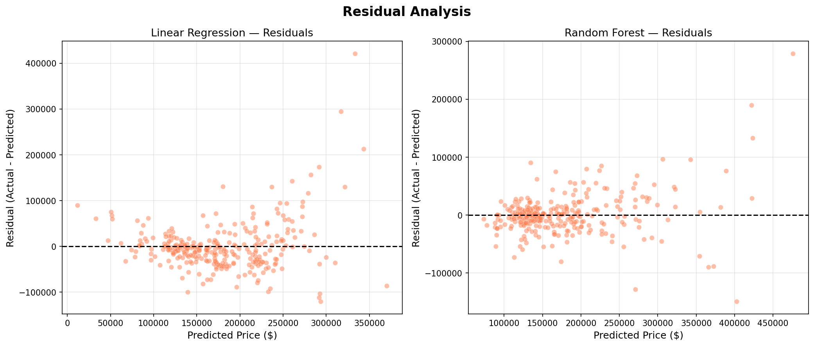
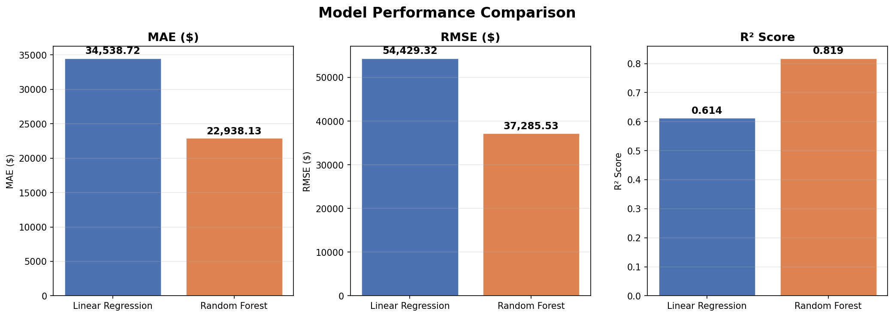
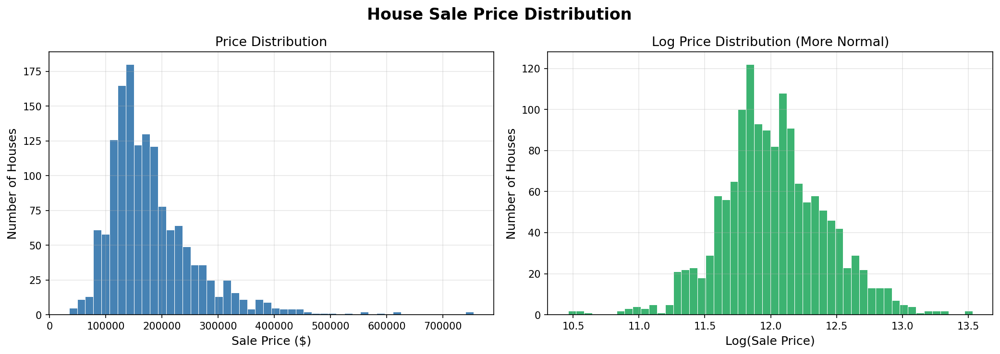

# 🏠 House Price Prediction


> An end-to-end machine learning project that predicts house sale prices.
> Compares **Linear Regression** vs **Random Forest** and automatically saves the best model.

---

## 📊 Model Results

| Model | MAE | RMSE | R² Score | CV R² |
|---|---|---|---|---|
| Linear Regression | $34,539 | $54,429 | 0.61 | 0.59 |
| **Random Forest ✅** | **$22,919** | **$37,011** | **0.82** | **0.76** |

> 🏆 **Random Forest wins** — explains 82% of house price variance with ~$23k average error

---

## 📸 Visual Results

### Actual vs Predicted Prices


### Residual Analysis


### Model Comparison


### Price Distribution


---

## 🧠 What This Project Does

- Loads and explores real estate data (2,919 records, 13 features)
- Removes duplicates and handles missing values using median/mode imputation
- Encodes categorical variables with OneHotEncoder
- Builds an sklearn Pipeline for clean, reproducible preprocessing
- Trains and compares 2 ML models side by side
- Evaluates using MAE, RMSE, R² and 5-fold Cross Validation
- Saves the best model using joblib

---

## 🛠️ Tools Used

- **Python** — core language
- **Pandas & NumPy** — data manipulation
- **scikit-learn** — ML pipeline, models, evaluation
- **Matplotlib & Seaborn** — visualizations
- **joblib** — model saving

---

## 📁 Project Files

| File | Description |
|---|---|
| `house_price_prediction_ml_project.py` | Main ML script |
| `HousePricePrediction.csv` | Dataset (2,919 records) |
| `house_price_model.pkl` | Saved best model (Random Forest) |
| `requirements.txt` | Python dependencies |
| `chart1_actual_vs_predicted.png` | Actual vs Predicted chart |
| `chart2_residuals.png` | Residual analysis chart |
| `chart3_model_comparison.png` | Model comparison chart |
| `chart4_price_distribution.png` | Price distribution chart |

---

## ▶️ How to Run

```bash
# 1. Install dependencies
pip install -r requirements.txt

# 2. Run the project
python house_price_prediction_ml_project.py
```

---

## 👤 Author

**Sharmeen Ahsan** — Python Developer | Data Analysis | Machine Learning

📍 Rawalpindi, Pakistan
💼 Available for freelance work → sharmeens19@gmail.com
